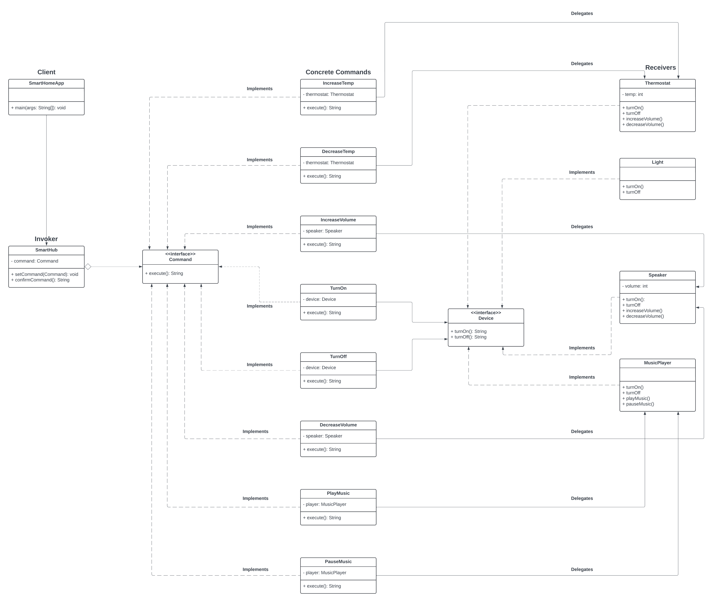

# Lab Assignment 2
This is Laboratory Assignment 2 for the course, Software Engineering 1, taken during the First Semester of Academic Year, 2025-2026, at New Era University.

## Problem Statement
**Smart Home Automation**

Imagine you are building a smart home automation system where various devices (lights, thermostat, music player, etc.) can be controlled remotely using a central hub or app. Each device has different functionalities, but you want to create a unified and flexible control mechanism.

Design a system that allows you to control multiple smart home devices with ease. Your goal is to create a solution where:
<ol>
  <li>You can control a variety of devices from a central hub or app, sending commands like "Turn On," "Turn Off," "Increase Temperature," "Decrease Volume," etc.</li>
  <li>Each device has unique actions associated with these commands. For example, turning on the lights might involve changing their brightness level, while turning on the music player may involve playing a specific playlist.</li>
  <li>New devices can be seamlessly integrated into the system without modifying existing code. You want to ensure that adding a new device does not require changes to the central control logic.</li>
  <li>Devices can be controlled without the central hub or app needing to understand the internal workings of each device. It should send high-level commands without needing low-level details.</li>
</ol>

Your challenge is to apply a design pattern that provides a flexible and scalable way to control a variety of smart home devices, ensuring that new devices can be added without disrupting the functionality of the existing system.

## Class Diagram

*This assignment was done in Java.*
